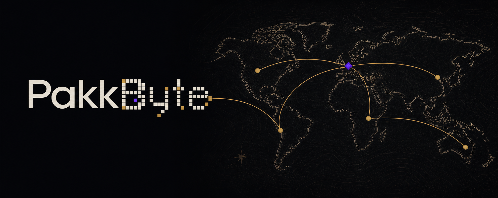

  

<h1 align="center">PakkByte</h1>

  <strong>Agentic AI Architecture</strong> 
  I design agents that plan, coordinate, and get real work done.

  
  
  

## What I build

- **Agent workflows** that plan, use tools, and hand work off clearly.
- **Automations and integrations** that connect useful AI capabilities to existing systems.
- **Reliability layers** such as approvals, guardrails, recovery paths, and evidence of what happened.

## From ambitious idea to reliable result

We clarify the goal, build around real constraints, and verify the outcome.

[How PakkByte works →](./APPROACH.md)

## A good place to start

Bring a project, partnership, or process worth improving. A useful starting point includes:

- The problem or slow workflow
- Who it affects
- The outcome you want
- The tools, limits, or risks that matter

[Start a project](https://github.com/PakkByte/PakkByte/issues/new?template=opportunity.yml) or [join the public discussion](https://github.com/PakkByte/PakkByte/discussions). It doesn’t need to be polished.

> GitHub issues and discussions are public. Don’t include passwords, private information, or anything confidential.
