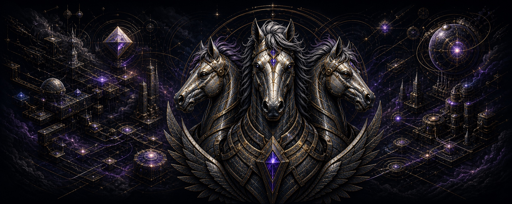

  

<h1 align="center">PakkByte</h1>

  <strong>Agentic AI Architecture</strong> 
  Architecting useful, reliable agentic AI—and turning ambitious ideas into practical systems.

  
  
  

## Currently creating

<table>
  <tr>
    <td width="33%" valign="top">
      <h3>Agentic architecture</h3>
      Coordinated agents built around shared objectives, clear boundaries, and reliable handoffs.
    </td>
    <td width="33%" valign="top">
      <h3>Practical automation</h3>
      Useful workflows that move ideas out of the prototype stage and into repeatable action.
    </td>
    <td width="33%" valign="top">
      <h3>Public field notes</h3>
      Clear demos and case studies drawn from experiments as they become ready to share.
    </td>
  </tr>
</table>

## Focus and tools

## Featured work

### [PakkByte / PakkByte](https://github.com/PakkByte/PakkByte)

The public home for what I’m creating, how I work, and where new collaborations begin. Public builds will be added here as they are ready—without dressing unfinished experiments up as shipped products.

## The Triarch

The PakkByte emblem represents three coordinated roles—**Architect, Creator, and Guardian**—aligned around one shared objective. One system, multiple intelligences, useful outcomes.

[Explore the visual identity and its meaning →](./BRAND.md)

## Work with me

I’m open to:

- Agentic AI architecture and prototypes
- Practical AI automation and workflow design
- Collaborations, client work, and ambitious ideas

**Have an idea or opportunity? [Start a conversation and let’s make something happen.](https://github.com/PakkByte/PakkByte/issues/new?template=opportunity.yml)**

> GitHub issues are public. Please keep private credentials, confidential information, and sensitive commercial details out of the initial message.
